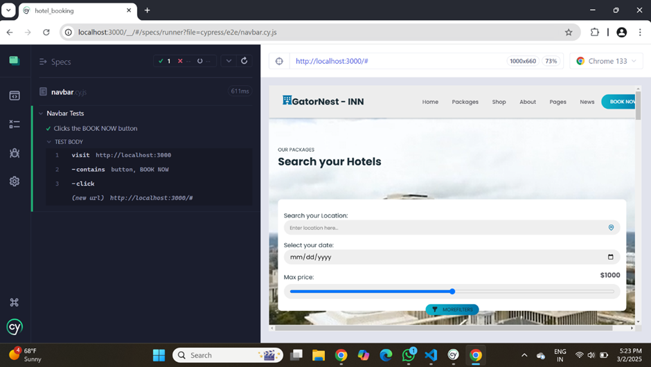

### Contributors

* Chandra Mouli Dasari
* Gurudeep Paleti
* Harsha Vardhan Reddy Palagiri 
* Tarunkrishna Dasari

Github: https://github.com/moulionmission/GATORNEST-INN 

## Sprint 2

___FRONTEND___

**Completed work**

In sprint 2, the following tasks were completed for the frontend of our project:

- Implemented Cards for rooms in the main component of the project.
- Designed the room cards UI to ensure a screen responsive and appealing layout.
- Added animations shadows and pictures zoom in and zoom out functionalities for cards
- Done necessary styling and formatting to enhance visual appeal

**Unit testing**

We use React Testing Library to simulate user interactions and query the DOM, verifying the rendered output.

Main component: Displays a list of room card with details such as price, title, description, location and “DETAILS ” button.

Home component: Gives a landing page with a UF video background running on loop, form for inputs from the user with a price range and filter options.

Navbar component: Verifying the api endpoints return the correct HTTP status code. Ensure proper errors handling for invalid requests.

**Tools used:**

- Jest
- React Testing Library
- Jest-DOM
- Go’s Built-in Testing package
- Net/http/httptest for api endpoints

**Navbar component tests**

. server.go

. server_test.go

Location: backend/

**Main component tests**

. Rendering the section title

. Room cards count

. Room card details

Location: src/Components/Main/Main.test.js

**Home component tests**

. Text content and titles

. Input fields

. Price range input

. Filter button and video element

Location: src/Components/Home/Home.test.js

**Cypress e2e testing**



---

___BACKEND___

In sprint 2, the following tasks were completed for the backend of our project:

- Implemented Reservation model and guest information & payment information storage in SQL
- Ran Unit Tests on Backend API endpoints
- Integrated the GO SQL Backend API with the frontend

## BACKEND API Documentation

### Guest Endpoints
- **GET /guests** - Fetch all guests
- **GET /guests/{id}** - Fetch a specific guest by ID
- **POST /guests** - Create a new guest
- **PUT /guests/{id}** - Update guest details
- **DELETE /guests/{id}** - Delete a guest

## Payment Endpoints
- **GET /payments** - Fetch all payments
- **GET /payments/{id}** - Fetch a specific payment by ID
- **POST /payments** - Create a new payment
- **PUT /payments/{id}** - Update payment details
- **DELETE /payments/{id}** - Delete a payment

## Room Endpoints
- **GET /rooms/{room_type}** - Fetch a specific room by Room Type


# Backend Unit testing

We used GO Unit Testing to test each endpoint and verify actual results with expected results.

**Guests Endpoint Unit Test Cases**

 1. **Get All Guests**
    - **Method:** `GET`
    - **URL:** `/guests`
    - **Expected Status:** `200 OK`
    - **Expected Response:** A list of all guests in JSON format.

2. **Get Guest by ID**
    - **Method:** `GET`
    - **URL:** `/guests/1`
    - **Expected Status:** `200 OK`
    - **Expected Response:** JSON object of the guest with ID `1`.

3. **Create Guest**
    - **Method:** `POST`
    - **URL:** `/guests`
    - **Request Body:**
    ```json
    {
        "name": "John Doe",
        "email": "john@example.com"
    }
    ```
    - **Expected Status:** `201 Created`
    - **Expected Response:** JSON object of the created guest with assigned ID.

4. **Update Guest**
    - **Method:** `PUT`
    - **URL:** `/guests/1`
    - **Request Body:**
    ```json
    {
        "name": "John Smith"
    }
    ```
    - **Expected Status:** `200 OK`
    - **Expected Response:** Updated guest details in JSON format.

5. **Delete Guest**
    - **Method:** `DELETE`
    - **URL:** `/guests/1`
    - **Expected Status:** `204 No Content`
    - **Expected Response:** No response body.

---

**Payments Endpoint Unit Test Cases**

6. **Get All Payments**
    - **Method:** `GET`
    - **URL:** `/payments`
    - **Expected Status:** `200 OK`
    - **Expected Response:** A list of all payments in JSON format.

7. **Get Payment by ID**
    - **Method:** `GET`
    - **URL:** `/payments/1`
    - **Expected Status:** `200 OK`
    - **Expected Response:** JSON object of the payment with ID `1`.

8. **Create Payment**
    - **Method:** `POST`
    - **URL:** `/payments`
    - **Request Body:**
    ```json
    {
        "amount": 100.0,
        "guest_id": 1
    }
    ```
    - **Expected Status:** `201 Created`
    - **Expected Response:** JSON object of the created payment with assigned ID.

9. **Update Payment**
    - **Method:** `PUT`
    - **URL:** `/payments/1`
    - **Request Body:**
    ```json
    {
        "amount": 150.0
    }
    ```
    - **Expected Status:** `200 OK`
    - **Expected Response:** Updated payment details in JSON format.

10. **Delete Payment**
    - **Method:** `DELETE`
    - **URL:** `/payments/1`
    - **Expected Status:** `204 No Content`
    - **Expected Response:** No response body.

---

**Rooms Endpoint Unit Test Cases**

11. **Get Room by Type**
    - **Method:** `GET`
    - **URL:** `/rooms/Single`
    - **Expected Status:** `200 OK`
    - **Expected Response:** JSON object of the rooms with room type `Single`.


---

These unit tests ensure that each API endpoint is functioning correctly and returning the expected status codes.


## License

[MIT](https://choosealicense.com/licenses/mit/)