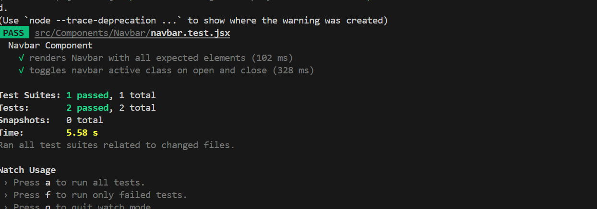

Project Documentation - Sprint 3 Updates

Demo Video: https://drive.google.com/file/d/1-lcOqpQGe7xOU7GreFO7C5n0pOZzp6HN/preview

___FRONTEND___

In sprint 3, significant updates were made to improve user interaction and user interface design, leveraging animations and modal pop-ups. The AOS library was introduced to provide scroll-based animations, enhancing the user experience. Additionally, a booking modal was added to facilitate room reservations, incorporating functionality for fee calculation and data input forms.

Key Features Implemented:
=========================

1\. AOS (Animate On Scroll):
----------------------------

Description: The AOS library was integrated into both the Footer and Main components to provide smooth, scroll-based animations when elements come into view. This enhances the visual appeal of the application and guides the user’s attention to key areas of the page.

Usage:  
 - In the Footer component, various elements like text, links, and icons fade in when they enter the viewport.  
 - In the Main component, each room card fades in with an animation as the user scrolls down the page.

Implementation:  
 - The AOS library was initialized in the useEffect hook to apply the fade-up effect on elements as they come into view.

2\. Modal Popup for Room Booking:
---------------------------------

Description: A modal popup was introduced in the Main component to allow users to book rooms. The modal is triggered when a user clicks the 'Book' button on any room card.

Functionality:  
 - The user is prompted to enter personal details, including their name, email, and booking dates.  
 - The total fee is dynamically calculated based on the selected room and the number of nights the user intends to stay.  
 - Once the user confirms the booking, the details are logged, and the modal is closed.

Implementation:  
 - A useState hook is used to manage the state of the modal, selected room details, and form data.  
 - The 'handleBookClick' function triggers the modal and sets the room's fee and title.  
 - The 'handleBookingConfirm' function logs the booking details.  
 - The modal includes an input form for collecting user details and booking dates.

3\. Dynamic Fee Calculation:
----------------------------

Description: The application calculates the total fee for a room based on the start and end dates selected by the user. This functionality is tied to the modal where users input their booking dates.

Implementation:  
 - The 'calculateFee' function computes the total fee based on the number of nights between the selected start and end dates.

4\. Room Availability Fetching:
-------------------------------

Description: The availability of rooms is fetched from the backend based on the room type. This feature allows users to check the availability of rooms before confirming their booking.

Implementation:  
 - A function 'fetchAvailableRooms' is used to send a request to the backend to retrieve available rooms for the selected room type.  
 - The response is displayed in a list showing available room numbers and their price.

Impact:
=======

User Experience: The integration of AOS animations provides a more dynamic and engaging user interface, improving the overall feel of the website.

Functionality: The modal popup and fee calculation functionalities make the booking process more seamless, allowing users to complete their reservations easily and view the associated costs in real time.

Backend Integration: The feature to fetch available rooms based on the selected room type enhances the interactive experience and ensures users have access to up-to-date information.

Future Enhancements:
====================

Form Validation: Adding validation to the booking form to ensure that all fields are correctly filled before submission.

API Integration: Implementing a complete backend API to handle room bookings and data storage.

Conclusion:
===========

Sprint 3 successfully implemented several key features that enhance both the visual appeal and usability of the application. The integration of AOS for animations and the booking modal provides a solid foundation for further features and improvements in the upcoming sprints.

  

*Unit test case for Navbar component*

toggles navbar active class on open and close

renders Navbar with all expected elements

Unit tests screen shots:


=================================================

___BACKEND___

In sprint 3, we have made the following progress for the backend:
- Paused development on payment system and reallocated efforts into new login/register feature
- Implemented Basic Reservation model and token-based login/registration functionality in SQL
- Link data to authenticated users


- Ran Unit Tests on Backend API endpoints
- Continued the GO SQL Backend API with the frontend, although more of a challenge now

## BACKEND API Documentation

### Authentication Endpoints
- **POST /register** - Registers a new user
- **POST /login** - Authenticates a user and returns a JWT token

### Guest Endpoints
- **GET /guests** - Fetch all guests
- **GET /guests/{id}** - Fetch a specific guest by ID
- **POST /guests** - Create a new guest
- **PUT /guests/{id}** - Update guest details
- **DELETE /guests/{id}** - Delete a guest
- **GET /profile** - Retrieves details of the authenticated user

## Payment Endpoints
- **GET /payments** - Fetch all payments
- **GET /payments/{id}** - Fetch a specific payment by ID
- **POST /payments** - Create a new payment
- **PUT /payments/{id}** - Update payment details
- **DELETE /payments/{id}** - Delete a payment

## Room Endpoints
- **POST /reservations/** - Creates room reservation for user
- **GET /reservations/{id}** - get room reservation made by user based on user ID

# Backend Unit testing

We used GO Unit Testing to test each endpoint and verify actual results with expected results.

**Guests Endpoint Unit Test Cases**

 1. **Get All Guests**
    - **Method:** `GET`
    - **URL:** `/guests`
    - **Expected Status:** `200 OK`
    - **Expected Response:** A list of all guests in JSON format.

2. **Get Guest by ID**
    - **Method:** `GET`
    - **URL:** `/guests/1`
    - **Expected Status:** `200 OK`
    - **Expected Response:** JSON object of the guest with ID `1`.

3. **Create Guest**
    - **Method:** `POST`
    - **URL:** `/guests`
    - **Request Body:**
    ```json
    {
        "name": "John Doe",
        "email": "john@example.com"
    }
    ```
    - **Expected Status:** `201 Created`
    - **Expected Response:** JSON object of the created guest with assigned ID.

4. **Update Guest**
    - **Method:** `PUT`
    - **URL:** `/guests/1`
    - **Request Body:**
    ```json
    {
        "name": "John Smith"
    }
    ```
    - **Expected Status:** `200 OK`
    - **Expected Response:** Updated guest details in JSON format.

5. **Delete Guest**
    - **Method:** `DELETE`
    - **URL:** `/guests/1`
    - **Expected Status:** `204 No Content`
    - **Expected Response:** No response body.

---

**Payments Endpoint Unit Test Cases**

6. **Get All Payments**
    - **Method:** `GET`
    - **URL:** `/payments`
    - **Expected Status:** `200 OK`
    - **Expected Response:** A list of all payments in JSON format.

7. **Get Payment by ID**
    - **Method:** `GET`
    - **URL:** `/payments/1`
    - **Expected Status:** `200 OK`
    - **Expected Response:** JSON object of the payment with ID `1`.

8. **Create Payment**
    - **Method:** `POST`
    - **URL:** `/payments`
    - **Request Body:**
    ```json
    {
        "amount": 100.0,
        "guest_id": 1
    }
    ```
    - **Expected Status:** `201 Created`
    - **Expected Response:** JSON object of the created payment with assigned ID.

9. **Update Payment**
    - **Method:** `PUT`
    - **URL:** `/payments/1`
    - **Request Body:**
    ```json
    {
        "amount": 150.0
    }
    ```
    - **Expected Status:** `200 OK`
    - **Expected Response:** Updated payment details in JSON format.

10. **Delete Payment**
    - **Method:** `DELETE`
    - **URL:** `/payments/1`
    - **Expected Status:** `204 No Content`
    - **Expected Response:** No response body.

---

**Rooms Endpoint Unit Test Cases**

11. **Make Reservation**
    - **Method:** `POST`
    - **URL:** `/reservations/`
    - **Request Body:**
    ```json
    {
        "check_in_date": "2025-03-27",
        "check_out_date": "2025-03-28",
        "email": "jr203@gmail.com",
        "first_name": "Jason",
        "guest_id": 2,
        "last_name": "Robb",
        "reservation_id": 3,
        "room_id": 1,
        "status": "Pending",
        "total_price": 90
    }
    ```
    - **Expected Status:** `200 OK`
    - **Expected Response:** JSON object of the reservation (same as request body) alongside user information.

12. **Get Reservations by ID**
    - **Method:** `GET`
    - **URL:** `/payments/2`
    - **Expected Status:** `200 OK`
    - **Expected Response:** JSON object of all reservations made by the user with User ID `2`.
---

These unit tests ensure that each API endpoint is functioning correctly and returning the expected status codes.
